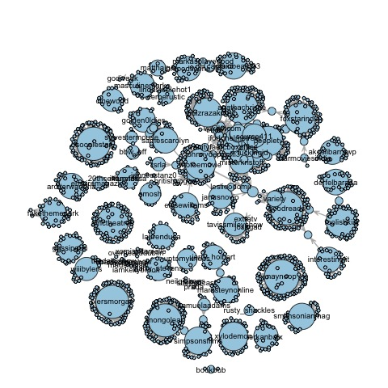
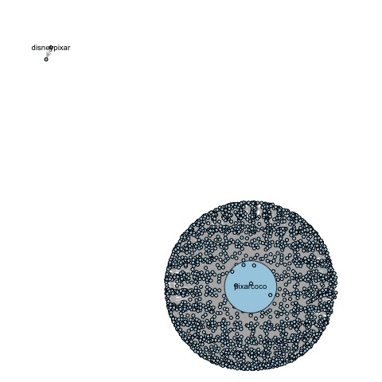
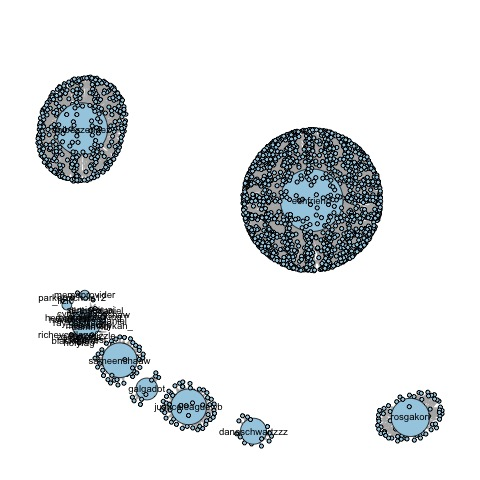
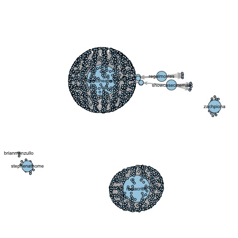
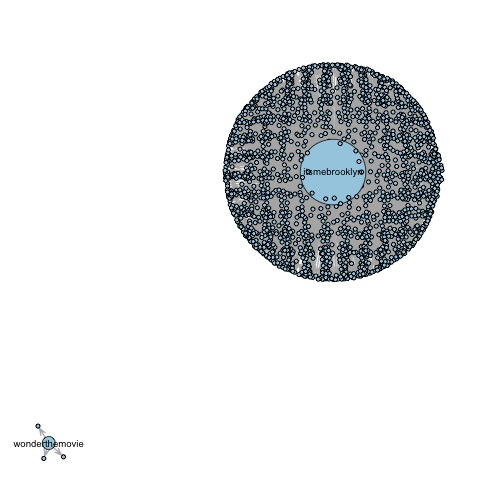

```{r setup, include=FALSE}
knitr::opts_chunk$set(echo = FALSE, warning=FALSE, message=FALSE)
require(revealjs)
require(tidyverse)
require(dplyr)
require(lubridate)
require(tm)
require(wordcloud)
require(RColorBrewer)
require(ggplot2)
require(ggvis)
require(plotly)
require(knitr)
require(sna)
require(maps)
require(maptools)
require(igraph)
require(sp)
require(tidytext)
require(xtable)
require(scales)
require(syuzhet)
require(reshape2)
require(stringr)
require(rvest)
require(Unicode)
require(png)
```

```{r}
# Import all the data parts
MOE_part1 <- read.csv('Data/tweets_MOE.csv', stringsAsFactors=FALSE)
Co_part1 <- read.csv('Data/tweets_Coco.csv', stringsAsFactors=FALSE)
JL_part1 <- read.csv('Data/tweets_JL.csv', stringsAsFactors=FALSE)
DH_part1 <- read.csv('Data/tweets_DH.csv', stringsAsFactors=FALSE)
W_part1 <- read.csv('Data/tweets_W.csv', stringsAsFactors=FALSE)

MOE_part2 <- read.csv('Data/tweets_MOE2.csv', stringsAsFactors=FALSE)
Co_part2 <- read.csv('Data/tweets_Coco2.csv', stringsAsFactors=FALSE)
JL_part2 <- read.csv('Data/tweets_JL2.csv', stringsAsFactors=FALSE)
DH_part2 <- read.csv('Data/tweets_DH2.csv', stringsAsFactors=FALSE)
W_part2 <- read.csv('Data/tweets_W2.csv', stringsAsFactors=FALSE)


# Remove duplicates and combine all the data parts of different topic
MOE <- rbind(MOE_part1 %>% slice(121:n()), MOE_part2)

Coco <- rbind(Co_part1 %>% slice(1431:n()), Co_part2)

JL <- rbind(JL_part1 %>% slice(3333:n()), JL_part2)

DH <- rbind(DH_part1 %>% slice(16:n()), DH_part2)

Wonder <- rbind(W_part1 %>% slice(45:n()), W_part2)


# Add a new column called Movie_Name to each data parts
MOE <- MOE %>% mutate(MovieName = 'Murder on the Orient Express')
Coco <- Coco %>% mutate(MovieName = 'Coco')
JL <- JL %>% mutate(MovieName = 'Justice League')
DH <- DH %>% mutate(MovieName = "Daddy's Home 2")
Wonder <- Wonder %>% mutate(MovieName = 'Wonder')


# Combine all the data parts
MovieData <- rbind(MOE, Coco, JL, DH, Wonder)

# Variable Selection
MovieData <- MovieData %>%
  select(MovieName, text, favoriteCount, created, screenName, replyToSN, 
         statusSource, retweetCount, isRetweet, longitude, latitude)

# Variable Transformation
MovieData$MovieName <- as.factor(MovieData$MovieName)
MovieData$created <- as.POSIXct(MovieData$created)

# Separate MovieData into parts based on movie name
new_MOE <- filter(MovieData, MovieName == 'Murder on the Orient Express')
new_Coco <- filter(MovieData, MovieName == 'Coco')
new_JL <- filter(MovieData, MovieName == 'Justice League')
new_DH <- filter(MovieData, MovieName == "Daddy's Home 2")
new_Wonder <- filter(MovieData, MovieName == 'Wonder')
```


# Introduction
## Introduction

<small>My primary motivation was to explore reviews of different types of movies posted by users located in different regions based on the data source from Twitter. So I chose five recent movies, **Murder on the Orient Express**, **Coco**, **Justice League**, **Daddy's Home 2**, **Wonder**, as my research subjects.</small>

```{r, out.width = "150px"}


include_graphics("Pictures/DH2.jpg")

```

<small>The analysis will help the moviegoers and the movie industry improve box-office results and help people easily decide what kind of movies to see basis their interests.</small>

# Exploratory Data Analysis
## Number of Tweets

$~$

```{r out.width = "500px", out.height = "200px"}
# Count the original tweets and retweets and rename the columns
NumTweets <- MovieData %>%
  group_by(MovieName) %>%
  count(isRetweet) %>%
  spread(key = isRetweet, value = n)

# Add new columns: Movie Type and Release Date
NumTweets$MovieType <- c('Animation', 'Comedy', 'Action', 'Mystery', 'Drama')
NumTweets$ReleaseDate <- c('2017-11-22', '2017-11-10', '2017-11-17', 
                           '2017-11-10', '2017-11-17')
# Rename the columns
colnames(NumTweets) <- c("Movie Name", "Number of Original Tweets", "Number of Retweets", 'Movie Type', 'Release Date')

# Reorder the columns and create a table
kable(NumTweets[, c(1, 4, 5, 2, 3)], align = c('l', 'c', 'c', 'c', 'c'))
```


## Change of Number of Tweets over Time

```{r out.width = "900px", out.height = "500px"}
MovieData %>% 
  mutate(date = as_date(created, tz = "America/New_York")) %>%
  group_by(MovieName) %>%
  count(date) %>%
  ggvis(~date, ~n, fill = ~MovieName) %>%
  layer_points() %>%
  layer_smooths(stroke = ~MovieName) %>%
  add_axis("x", title = "Date") %>%
  add_axis("y", title = "Number of Tweets", title_offset = 50) 
```


## Top Tweeters
```{r out.width = "900px", out.height = "500px"}
# Create a function for plotting top 20 tweeters about different movies
numPlot <- function(data){
  data %>% 
    group_by(MovieName) %>%
    count(screenName) %>% 
    arrange(desc(n)) %>%
    slice(1:20) %>% 
    ggplot(aes(reorder(screenName, n), n)) + 
    labs(x = "Screen Name", y = "Tweets") + 
    theme(axis.text = element_text(size = 9), 
          axis.title = element_text(size = 9),
          axis.title.x = element_text(vjust = 1),
          axis.text.x = element_text(angle = 45))
}

MOEnumPlot <- numPlot(new_MOE) +
  geom_col(fill = "forestgreen") +
  ggtitle('Murder on the Orient Express')
ggplotly(MOEnumPlot)
```

## Top Tweeters
```{r out.width = "900px", out.height = "500px"}
CoconumPlot <- numPlot(new_Coco) + 
  geom_col(fill = "tomato2")  +
  ggtitle('Coco')
ggplotly(CoconumPlot)
```

## Top Tweeters
```{r out.width = "900px", out.height = "500px"}
JLnumPlot <- numPlot(new_JL)+ 
  geom_col(fill = "deepskyblue2") +
  ggtitle('Justice League')
ggplotly(JLnumPlot)
```

## Top Tweeters
```{r out.width = "900px", out.height = "500px"}
DHnumPlot <- numPlot(new_DH) + 
  geom_col(fill = "goldenrod2") +
  ggtitle("Daddy's Home 2")
ggplotly(DHnumPlot)
```

## Top Tweeters
```{r out.width = "900px", out.height = "500px"}
WondernumPlot <- numPlot(new_Wonder) + 
  geom_col(fill = "lightpink") +
  ggtitle('Wonder')
ggplotly(WondernumPlot)
```

## Platforms of Users
```{r}
# Create a function to extract platforms from status sources
str2platform <- function(data) {
  par(mar = c(5, 1.5, 3, 1.5))
  
  data$statusSource = substr(data$statusSource, 
                        regexpr('>', data$statusSource) + 1, 
                        regexpr('</a>', data$statusSource) - 1)
  tail(sort(prop.table(table(data$statusSource))), 10)
}

# Make dot plots
par(mfrow=c(2,3))

dotchart(str2platform(new_MOE), color = "#A6761D", main = 'Murder on the Orient Express')
dotchart(str2platform(new_Coco), color = "#1B9E77", main = 'Coco')
dotchart(str2platform(new_JL), color = "#D95F02", main = 'Justice League')
dotchart(str2platform(new_DH), color = "#7570B3", main = "Daddy's Home 2")
dotchart(str2platform(new_Wonder), color = "#66A61E", main = 'Wonder')
mtext('Percentage of Tweets about Different Movies posted by Different Platforms',
      side = 1, line = -1.5, outer = TRUE, cex = 1)
```


## Density of Original Tweets and Retweets
```{r out.width='900px', out.height='500px'}
timeDist = MovieData %>%
  ggplot(aes(created)) + 
    geom_density(aes(fill = isRetweet), alpha = .5) +
    xlab('All tweets')  +
    theme(legend.justification = c(1, 1), 
          legend.position = c(1, 1)) +
  facet_wrap(~ MovieName)
ggplotly(timeDist)
```


## Retweet Network
## Retweet Network of Orient Express
```{r, out.width = "500px", out.height='500px'}

```

## Retweet Network of Coco
```{r, out.width = "500px", out.height='500px'}

```

## Retweet Network of Justice League
```{r, out.width = "500px", out.height='500px'}

```

## Retweet Network of Daddy's Home 2
```{r, out.width = "500px", out.height='500px'}

```

## Retweet Network of Wonder
```{r, out.width = "500px", out.height='500px'}

```

# Geolocations of Tweets
## World Map
```{r warning=FALSE, message=FALSE, echo=FALSE}
# Remove observations without showing longitude and latitude
MDwithloc <- MovieData[!is.na(MovieData$latitude), ] 
```

```{r out.width='950px', out.height='550px'}
# create a layer of borders
mapWorld <- borders("world", colour="white", fill="lightblue") 
ggplot() + mapWorld +
  theme(axis.line = element_blank(), 
        axis.text = element_blank(), 
        axis.ticks = element_blank(), 
        axis.title = element_blank(), 
        plot.background = element_blank()) +
  geom_point(data = MDwithloc, 
             aes(x = longitude, y = latitude, color = MovieName), 
             size = 1, 
             alpha = 0.6) +
  ggtitle('Figure 14: World Map of Tweets') +
  theme(legend.title = element_text(size = 5), 
        legend.text = element_text(size = 5),
        legend.justification=c(0,0), legend.position=c(0,0))
```

## USA Map
```{r warning=FALSE, message=FALSE, echo=FALSE}
# filter location in USA
usaTweets <- MDwithloc[(MDwithloc$longitude < -65) & (MDwithloc$longitude > -145) & (MDwithloc$latitude > 25) & (MDwithloc$latitude < 50), ]
```

```{r out.width='800px', out.height='500px'}
# Create an object containing the boundaries of states in United States
states <- map_data("state")

# The following code creates the graphic.
ggplot(states) +
   # The following lines define the map-areas.
   geom_map(aes(map_id = region), 
           map = states, 
           fill = "white", 
           color = "grey50", 
           size = 0.25) +  
  expand_limits(x = states$long, 
                y = states$lat) + 
  # The following parameters could be altered to insert axes, title, etc.
  theme(axis.line = element_blank(), 
        axis.text = element_blank(), 
        axis.ticks = element_blank(), 
        axis.title = element_blank(), 
        panel.background = element_blank(), 
        panel.border = element_blank(), 
        panel.grid.major = element_blank(), 
        plot.background = element_blank(), 
        plot.margin = unit(0 * c(-1.5, -1.5, -1.5, -1.5), "lines")) + 
  # The next line plots points for each tweet
  geom_point(data = usaTweets, 
             aes(x = longitude, y = latitude, color = MovieName), 
             size = 1, 
             alpha = 0.6) +   
  ggtitle('Figure 15: USA Map of Tweets') +
  theme(plot.title = element_text(size = 10),
        legend.title = element_text(size = 6), 
        legend.text = element_text(size = 6),
        legend.position=c(0.9, 0.1))
```


## States Map
```{r}
# Remove observations without showing longitude and latitude
MDwithloc <- MovieData[!is.na(MovieData$latitude), ] 
```

```{r}
# filter location in USA
usaTweets <- MDwithloc[(MDwithloc$longitude < -65) & (MDwithloc$longitude > -145) & (MDwithloc$latitude > 25) & (MDwithloc$latitude < 50), ]
```

```{r}
# Create an object containing the boundaries of states in United States
states <- map_data("state")

# Create a function that can transfer longitude and latitude into states in the US
latlong2state <- function(pointsDF) {
  # Prepare SpatialPolygons object with one SpatialPolygon
  # per state (plus DC, minus HI & AK)
  states <- map('state', fill=TRUE, col="transparent", plot=FALSE)
  IDs <- sapply(strsplit(states$names, ":"), function(x) x[1])
  states_sp <- map2SpatialPolygons(states, IDs=IDs,
                                   proj4string=CRS("+proj=longlat +datum=WGS84"))
  
  # Convert pointsDF to a SpatialPoints object 
  pointsSP <- SpatialPoints(pointsDF, 
                            proj4string=CRS("+proj=longlat +datum=WGS84"))
  
  # Use 'over' to get _indices_ of the Polygons object containing each point 
  indices <- over(pointsSP, states_sp)
  
  # Return the state names of the Polygons object containing each point
  stateNames <- sapply(states_sp@polygons, function(x) x@ID)
  stateNames[indices]
}

# Create a data frame with only longitude and latitude
usaTweetsPoints <- data.frame(x = usaTweets$longitude, y = usaTweets$latitude)

# Use latlong2state function to create region column
usaTweets$region <- latlong2state(usaTweetsPoints)

# Remove missing values
usaTweets <- usaTweets[!is.na(usaTweets$region),]

# Create a function that can choose different movies from usaTweets and clean data 
selectMovie <- function(movie){
  # select certain movie
  statemap <- usaTweets[usaTweets$MovieName == movie, ]
  statemap$region <- as.factor(statemap$region)
  
  # count the number of tweets in different states
  statemap <- statemap %>%
    group_by(region) %>%
    count(region)
  
  statemap <- as.data.frame(list(region = unique(states$region))) %>%
    left_join(statemap)
  statemap[is.na(statemap)] <- 0
  
  return(statemap)
}


# Create a general syntax that plot the state map
plotstatemap <- ggplot() + 
  geom_map(data = states, map = states,
           aes(x=long, y = lat, map_id = states$region),  
           colour="white") + 
  theme_bw()  + 
  labs(x="", y="", fill = "Number of Tweets") +
  scale_y_continuous(breaks=c()) + 
  scale_x_continuous(breaks=c()) + 
  theme(panel.border = element_blank(), 
        legend.position='bottom',
        legend.title=element_text(size=10),
        plot.title = element_text(size = 10))


MOEmapData <- selectMovie('Murder on the Orient Express')
CocomapData <- selectMovie('Coco')
JLmapData <- selectMovie('Justice League')
DHmapData <- selectMovie("Daddy's Home 2")
WondermapData <- selectMovie('Wonder')
```

```{r out.width='700px', out.height='450px'}
plotstatemap +
  geom_map(data = MOEmapData, map = states, 
           aes(fill = n, map_id = MOEmapData$region)) + 
  scale_fill_continuous(low = "thistle2", high = "darkred", guide="colorbar") +
  ggtitle("Density of Tweets about Orient Express Movie in Different States in USA")
```

## States Map
```{r out.width='700px', out.height='450px'}
plotstatemap +
  geom_map(data = CocomapData, map = states, 
           aes(fill = n, map_id = CocomapData$region)) +
  scale_fill_continuous(low = "lightcyan1", high = "cadetblue4", guide="colorbar") +
  ggtitle("Density of Tweets about Coco in Different States in USA")
```

## States Map
```{r out.width='700px', out.height='450px'}
plotstatemap + 
  geom_map(data = JLmapData, map = states, 
           aes(fill = n, map_id = JLmapData$region)) +
  scale_fill_continuous(low = "peachpuff", high = 'salmon4', guide="colorbar") +
  ggtitle("Density of Tweets about Justice League in Different States in USA")

```

## States Map
```{r out.width='700px', out.height='450px'}
plotstatemap +
  geom_map(data = DHmapData, map = states, 
           aes(fill = n, map_id = DHmapData$region)) +
  scale_fill_continuous(low = 'slategray1', high = "mediumpurple4", guide="colorbar" ) +
  ggtitle("Density of Tweets about Daddy's Home 2 in Different States in USA")

```

## States Map
```{r out.width='700px', out.height='450px'}
plotstatemap + 
  geom_map(data = WondermapData, map = states, 
           aes(fill = n, map_id = WondermapData$region)) +
  scale_fill_continuous(low = "darkseagreen2", high = "darkseagreen4", guide="colorbar") +
  ggtitle("Density of Tweets about Wonder in Different States in USA")
```

# Sentiment Analysis
## Trending Words
```{r}
## ---- Prepare the text for sentiment analysis ----
cleantexts <- function(data){
  data$text <- sapply(data$text, function(x) iconv(x, "latin1", "ASCII", sub = ""))
  
  # convert all text to lower case
  data$text <- tolower(data$text)

  # replace blank space (“rt”)
  data$text <- gsub("rt", "", data$text)

  # replace @UserName
  data$text <- gsub("@\\w+", "", data$text)

  # remove punctuation
  data$text <- gsub("[[:punct:]]", "", data$text)

  # remove links
  data$text <- gsub("http\\w+", "", data$text)

  # remove tabs
  data$text <- gsub("[ |\t]{2,}", "", data$text)

  # remove blank spaces at the beginning
  data$text <- gsub("^ ", "", data$text)

  # remove blank spaces at the end
  data$text <- gsub(" $", "", data$text)
 
  # remove emojis
  data$text <- gsub('\\p{So}|\\p{Cn}', '',  data$text, perl = TRUE)

  # remove numbers
  data$text <- gsub('[[:digit:]]', '', data$text)

  return(data)
}
```


```{r out.width='800px', out.height='600px'}
# Apply cleantexts function
MOEwords = paste(cleantexts(new_MOE)$text, collapse=" ")
Cocowords = paste(cleantexts(new_Coco)$text, collapse=" ")
JLwords = paste(cleantexts(new_JL)$text, collapse=" ")
DHwords = paste(cleantexts(new_DH)$text, collapse=" ")
Wonderwords = paste(cleantexts(new_Wonder)$text, collapse=" ")

# Put everything in a single vector
all = c(MOEwords, Cocowords,JLwords, DHwords, Wonderwords)

# Remove stop-words
all = removeWords(all, c(stopwords("english"), 'murder', 'orient', 'express', 
                         'movie','justice', 'league', 'coco', 'daddys', 'home', 
                         'wonder','daddyshome', 'wondehemovie'))
                         
# Create term-document matrix and then convert as matrix
tdm =  as.matrix(TermDocumentMatrix(Corpus(VectorSource(all))))

# Add column names
colnames(tdm) = c("Murder on the\nOrient Express", "Coco", "Justice\nLeague", "Daddy's Home 2", "Wonder")

# Make comparison cloud
comparison.cloud(tdm, random.order=FALSE, colors = brewer.pal(5, "Set2"), 
                 title.size=1.5, max.words=300, scale = c(5,.5))
```

## Most Common Words about Orient Express

```{r}
# Create a function that break customer reviews in words and analyze word counts that contribute to each sentiment
SentimentWords <- function(data){
  words <- cleantexts(data) %>%
    select(text) %>%
    unnest_tokens(word, text) %>% 
    filter(!word %in% stop_words$word) %>%
    inner_join(get_sentiments("bing"), by = 'word') %>%
    count(word, sentiment, sort = TRUE) %>%
    group_by(sentiment) %>%
    top_n(10) %>%
    ungroup() %>%
    mutate(word = reorder(word, n)) 
  
  # Rename the columns
  colnames(words) <- c('Word', 'Sentiment', 'Count')
  
  return(words)
}
```


```{r}
kable(head(SentimentWords(new_MOE), 10), align = c('l', 'c', 'c'))
```

## Most Common Words about Coco

```{r}
kable(head(SentimentWords(new_Coco), 10), align = c('l', 'c', 'c'))
```

## Most Common Words about Justice League

```{r}
kable(head(SentimentWords(new_JL), 10), align = c('l', 'c', 'c'))
```

## Most Common Words about Daddy's Home 2

```{r}
kable(head(SentimentWords(new_DH), 10), align = c('l', 'c', 'c'))
```

## Most Common Words about Wonder

```{r}
kable(head(SentimentWords(new_Wonder), 10), align = c('l', 'c', 'c'))
```

## Sentiment Over Time about Orient Express
```{r out.height='550px', out.width='900px'}
# Create a function to generate sentiment score for each tweet
SentimentPlot <- function(data){
  data$clean_text <- str_replace_all(data$text, "@\\w+", "")
  # get sentiment score
  Sentiment <- get_nrc_sentiment(data$clean_text)
  
  alltweets_senti <- cbind(data, Sentiment)

  posnegtime <- alltweets_senti %>% 
    group_by(created = cut(created, breaks="1 days")) %>%
    summarise(negative = mean(negative),
              positive = mean(positive)) %>% melt

  colnames(posnegtime) <- c("timestamp", "sentiment", "meanvalue")
  posnegtime$sentiment = factor(posnegtime$sentiment,levels(posnegtime$sentiment)[c(2,1)])
  
  ggplot(data = posnegtime, 
         aes(x = as.Date(timestamp), y = meanvalue, group = sentiment)) +
    geom_line(size = 1, alpha = 0.9, aes(color = sentiment)) + 
    geom_point(size = 0.3) + 
    ylim(0, NA) + 
    theme(legend.title = element_blank(), 
          axis.title.x = element_blank(),
          axis.title.y = element_text(size = 10),
          plot.title = element_text(size = 12)) + 
    scale_x_date(breaks = date_breaks("5 days"), 
                 labels = date_format("%Y-%b")) + 
    ylab("Average sentiment score") 
}


# make Positive and negative sentiment plots over time
MOEsentiPlot <- SentimentPlot(new_MOE) + 
  scale_colour_manual(values = c("#40b8d0", "#b2d183"))

CocosentiPlot <- SentimentPlot(new_Coco) + 
  scale_color_manual(values = c("orange", "rosybrown1"))

JLsentiPlot <- SentimentPlot(new_JL) + 
  scale_color_brewer(palette="Accent")

DHsentiPlot <- SentimentPlot(new_DH) +
  scale_color_brewer(palette="Paired")

WondersentiPlot <- SentimentPlot(new_Wonder) + 
  scale_color_brewer(palette="Set1", direction = -1)

ggplotly(MOEsentiPlot)
```

## Sentiment Over Time about Coco
```{r out.height='550px', out.width='900px'}
ggplotly(CocosentiPlot)
```

## Sentiment Over Time about Justice League
```{r out.height='550px', out.width='900px'}
ggplotly(JLsentiPlot)
```

## Sentiment Over Time about Daddy's Home 2
```{r out.height='550px', out.width='900px'}
ggplotly(DHsentiPlot)
```

## Sentiment Over Time about Wonder
```{r out.height='550px', out.width='900px'}
ggplotly(WondersentiPlot)
```


# Emojis Analysis
```{r results='hide'}
Sys.setlocale(category = "LC_ALL", locale = "en_US.UTF-8")

## ---- utility functions ----
# Create a function that outputs the emojis found in a string as well as their occurences
count_matches <- function(string, matchto, description, sentiment = NA) {
  vec <- str_count(string, matchto)
  matches <- which(vec != 0)
  
  descr <- NA
  cnt <- NA
  
  if (length(matches) != 0) {
    descr <- description[matches]
    cnt <- vec[matches]
  } 
  
  df <- data.frame(text = string, description = descr, count = cnt, sentiment = NA)
  
  if (!is.na(sentiment) & length(sentiment[matches]) != 0) {
    df$sentiment <- sentiment[matches]
  }
  
  return(df)
}


# Create a function that applies count_matches on a vector of texts and outputs a data.frame
emojis_matching <- function(texts, matchto, description, sentiment = NA) {
  # convert tests to a format we can work with
  texts <- iconv(texts, from = "latin1", to = "ascii", sub = "byte")

  texts %>% 
    lapply(count_matches, matchto = matchto, description = description, sentiment = sentiment) %>%
    bind_rows
}
```

```{r }
# Read in emoji dictionary
emDict <- read.csv2("Data/emojis.csv", stringsAsFactors = FALSE) %>% 
  select(EN, ftu8, unicode) %>% 
  rename(description = EN, r.encoding = ftu8)

# Create a list with plain skin tones
skin_tones <- c("light skin tone", 
                "medium-light skin tone", 
                "medium skin tone",
                "medium-dark skin tone", 
                "dark skin tone")

# Remove plain skin tones and remove skin tone info in description
emDict <- emDict %>%
  # remove plain skin tones emojis
  filter(!description %in% skin_tones) %>%
  # remove emojis with skin tones info, e.g. remove woman: light skin tone and only keep woman
  filter(!grepl(":", description)) %>%
  mutate(description = tolower(description)) %>%
  mutate(unicode = as.u_char(unicode))
# all emojis with more than one unicode codepoint become NA 

matchto <- emDict$r.encoding
description <- emDict$description

# Create a function to rank emojis by occurence in data
rankemojis <- function(data){
  emojis_count <- emojis_matching(data$text, matchto, description) %>% 
    group_by(description) %>% 
    summarise(n = sum(count),
            dens = round(1000 * (n / nrow(data)), 1)) %>%
    arrange(-n)
  
  emojis_count$rank <- as.numeric(row.names(emojis_count))
  colnames(emojis_count)[1] <- 'name'
  return(emojis_count)
}

# Create a function that prepare data for making a bar plot with frequency of emojis
emojiplot <- function(emoji.count){
  df.plot <- subset(emoji.count, rank <= 10)
  df.plot <- arrange(df.plot, name)
  
  # import emojis images
  imgs <- lapply(paste0('emoji_files', '/', df.plot$name, '.png'), png::readPNG)
  g <- lapply(imgs, grid::rasterGrob)
  
  k <- 0.20 * (10/nrow(df.plot)) * max(df.plot$dens) 
  df.plot$xsize <- k 
  df.plot$ysize <- k 

  df.plot <- arrange(df.plot, name)
  
  # make bar plots
ggplot(data = df.plot, aes(x = rank, y = dens)) + 
    geom_bar(stat = 'identity', fill = 'dodgerblue4') +
    xlab('Rank') +
    ylab('Overall Frequency (per 1,000 Tweets)') +
    mapply(function(x, y, i) {
      annotation_custom(g[[i]], 
                      xmin = x-0.35*df.plot$xsize[i], 
                      xmax = x+0.35*df.plot$xsize[i], 
                      ymin = y-0.35*df.plot$ysize[i], 
                      ymax = y+0.35*df.plot$ysize[i])},
      df.plot$rank, df.plot$dens, seq_len(nrow(df.plot))) + 
    scale_x_continuous(expand = c(0, 0), breaks = seq(1, nrow(df.plot), 1), 
                     labels = seq(1, nrow(df.plot), 1)) +
    scale_y_continuous(expand = c(0, 0), limits = c(0, 1.10 * max(df.plot$dens))) +
    theme(panel.grid.minor.y = element_blank(),
        axis.title.x = element_text(size = 8), 
        axis.title.y = element_text(size = 8), 
        axis.text.x  = element_text(size = 8, colour = 'black'), 
        axis.text.y  = element_text(size = 8, colour = 'black'), 
        plot.title = element_text(size = 10))
}


## ---- most used emoji for each movie----
set.seed(2017)

MOEemojis <- rankemojis(new_MOE)
# random sampling since Coco and JL datasets are too large
Cocoemojis <- rankemojis(new_Coco[sample(nrow(new_Coco), 20000), ])
JLemojis <- rankemojis(new_JL[sample(nrow(new_JL), 20000), ])
DHemojis <- rankemojis(new_DH)
Wonderemojis <- rankemojis(new_Wonder)
```

## Emoji Reactions to Orient Express
```{r out.height='500px', out.width='800px'}
## ---- make emojis plot ----
emojiplot(MOEemojis)
```

## Emoji Reactions to Coco
```{r out.height='500px', out.width='800px'}
emojiplot(Cocoemojis)
```

## Emoji Reactions to Justice League
```{r out.height='500px', out.width='800px'}
emojiplot(JLemojis) 
```

## Emoji Reactions to Daddy's Home 2
```{r out.height='500px', out.width='800px'}
emojiplot(DHemojis)
```

## Emoji Reactions to Wonder
```{r out.height='500px', out.width='800px'}
emojiplot(Wonderemojis) 
```

# Conclusion
## Conclusion
<small>With the use of plethora of features in R, the analysis will provide key insights about those five movies, including timeline of tweets, user platforms of tweets, retweet network, etc. Also, maps were made to locate the tweets. The data was then reviewed graphically to explore the trending words in twitter about those movies and sentiment analysis was done using word cloud, line plots and horizontal bar charts, to tell us that
how different customers react to different types of movies.</small>

<small>Various results and analysis showed that most people in USA prefer action movies, then animation movie, like Coco. The comedy Daddy’s Home 2 is least noticed in twitter. Besides, based on the states maps, people in California, Texas, Florida, New York and Virginia tweets more about those movies. But sentiment analysis, and emoji analysis, all together show us positive reactions of customers associated with the movies. win, love, prize, and Perfect - customers associate movie with positive words like these. This can help movie industry in understanding how branding and associating with these words can further help them improving box office.</small>
