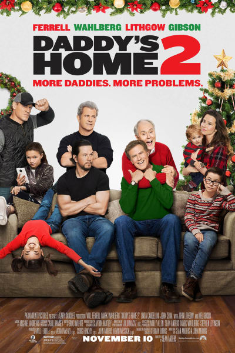

```{r setup, include=FALSE}
require(twitteR)
require(devtools)
require(base64enc)
require(data.table)
require(tidyverse)
require(dplyr)
require(lubridate)
require(tm)
require(wordcloud)
require(RColorBrewer)
require(ggplot2)
require(ggvis)
require(knitr)
require(network)
require(sna)
require(maps)
require(maptools)
require(igraph)
require(sp)
require(cowplot)
require(tidytext)
require(xtable)
require(scales)
require(syuzhet)
require(reshape2)
require(stringr)
require(rvest)
require(Unicode)
require(png)
```


# 1. Introduction

My primary motivation was to explore reviews of different types of movies posted by users located in different regions based on the data source from Twitter. So I chose five recent movies: **Murder on the Orient Express**, **Coco**, **Justice League**, **Daddy's Home 2**, **Wonder**, as my research subjects.

$~$

{width=123px}  {width=123px}  {width=123px}  {width=123px}  {width=123px}
$~$

The analysis mainly includes the exploratory analysis of different types of movies basis their attributes and the sentiment analysis on the tweets posted, to understand customer reviews for these five movies and understand the most frequently appearing words in customer reviews.

The data for this analysis has been collected from twitter from November 24, 2017 to December 8, 2017. This data will be used to visulaise the trends basis different attributes and also determine the popular opinions of the people. The text mining approach will be utilized to examine the sentiments of the people basis the twitter texts. 

The analysis will help the moviegoers and the movie industry to understand which words customers use to summarize their thoughts about the movie. They can use this analysis to improve box-office results. For the customers, the analysis will help them easily decide what kind of movies to see basis their interests.


```{r eval=FALSE, warning=FALSE, message=FALSE, echo=FALSE}
## ----- Collect Data from Twitter -----

# Twitter Search Setup
api_key <- "XXXXXXXXXXXXXXXXXXXXXXXX"
api_secret <- "XXXXXXXXXXXXXXXXXXXXXXXX"
access_token <- "XXXXXXXXXXXXXXXXXXXXXXXX"
access_token_secret <- "XXXXXXXXXXXXXXXXXXXXXXXX"

setup_twitter_oauth(api_key, api_secret, access_token, access_token_secret)


# Get tweets
#############################
tweets_MOE <- searchTwitter("#OrientExpressMovie OR Murder on the Orient Express", n = 15000, lang="en")
tweets_MOE.df <- twListToDF(tweets_MOE)
write.csv(tweets_MOE.df, "~/tweets_MOE.csv")

tweets_MOE2 <- searchTwitter("#OrientExpressMovie OR Murder on the Orient Express", n = 5000, lang="en", 
                             since = '2017-12-04', until = '2017-12-09')
tweets_MOE2.df <- twListToDF(tweets_MOE2)
write.csv(tweets_MOE2.df, "~/tweets_MOE2.csv")


#############################
tweets_Coco <- searchTwitter("#PixarCoco OR #Coco OR Pixar Coco", n = 150000, lang="en")
tweets_Coco.df <- twListToDF(tweets_Coco)
write.csv(tweets_Coco.df, "~/tweets_Coco.csv")

tweets_Coco2 <- searchTwitter("#PixarCoco OR #Coco OR Pixar Coco", n = 30000, lang="en", 
                              since = '2017-12-04', until = '2017-12-09')
tweets_Coco2.df <- twListToDF(tweets_Coco2)
write.csv(tweets_Coco2.df, "~/tweets_Coco2.csv")


#############################
tweets_JL <- searchTwitter("Justice League OR #JusticeLeague", n = 250000, lang="en")
tweets_JL.df <- twListToDF(tweets_JL)
write.csv(tweets_JL.df, "~/tweets_JL.csv")

tweets_JL2 <- searchTwitter("Justice League OR #JusticeLeague", n = 60000, lang="en", 
                            since = '2017-12-04', until = '2017-12-09')
tweets_JL2.df <- twListToDF(tweets_JL2)
write.csv(tweets_JL2.df, "~/tweets_JL2.csv")


#############################
tweets_DH <- searchTwitter("#DaddysHome2 OR Daddy’s Home 2", n = 10000, lang="en")
tweets_DH.df <- twListToDF(tweets_DH)
write.csv(tweets_DH.df, "~/tweets_DH.csv")

tweets_DH2 <- searchTwitter("#DaddysHome2 OR Daddy’s Home 2", n = 2000, lang="en", 
                            since = '2017-12-04', until = '2017-12-09')
tweets_DH2.df <- twListToDF(tweets_DH2)
write.csv(tweets_DH2.df, "~/tweets_DH2.csv")


#############################
tweets_W <- searchTwitter("#WonderTheMovie OR #Wonder", n = 20000, lang="en")
tweets_W.df <- twListToDF(tweets_W)
write.csv(tweets_W.df, "~/tweets_W.csv")

tweets_W2 <- searchTwitter("#WonderTheMovie OR #Wonder", n = 5000, lang="en", 
                           since = '2017-12-04', until = '2017-12-09')
tweets_W2.df <- twListToDF(tweets_W2)
write.csv(tweets_W2.df, "~/tweets_W2.csv")
```


```{r warning=FALSE, message=FALSE, echo=FALSE}
## ------- Data Preparation -------

# Import all the data parts
MOE_part1 <- read.csv('Data/tweets_MOE.csv', stringsAsFactors=FALSE)
Co_part1 <- read.csv('Data/tweets_Coco.csv', stringsAsFactors=FALSE)
JL_part1 <- read.csv('Data/tweets_JL.csv', stringsAsFactors=FALSE)
DH_part1 <- read.csv('Data/tweets_DH.csv', stringsAsFactors=FALSE)
W_part1 <- read.csv('Data/tweets_W.csv', stringsAsFactors=FALSE)

MOE_part2 <- read.csv('Data/tweets_MOE2.csv', stringsAsFactors=FALSE)
Co_part2 <- read.csv('Data/tweets_Coco2.csv', stringsAsFactors=FALSE)
JL_part2 <- read.csv('Data/tweets_JL2.csv', stringsAsFactors=FALSE)
DH_part2 <- read.csv('Data/tweets_DH2.csv', stringsAsFactors=FALSE)
W_part2 <- read.csv('Data/tweets_W2.csv', stringsAsFactors=FALSE)


# Remove duplicates and combine all the data parts of different topic
MOE <- rbind(MOE_part1 %>% slice(121:n()), MOE_part2)

Coco <- rbind(Co_part1 %>% slice(1431:n()), Co_part2)

JL <- rbind(JL_part1 %>% slice(3333:n()), JL_part2)

DH <- rbind(DH_part1 %>% slice(16:n()), DH_part2)

Wonder <- rbind(W_part1 %>% slice(45:n()), W_part2)


# Add a new column called Movie_Name to each data parts
MOE <- MOE %>% mutate(MovieName = 'Murder on the Orient Express')
Coco <- Coco %>% mutate(MovieName = 'Coco')
JL <- JL %>% mutate(MovieName = 'Justice League')
DH <- DH %>% mutate(MovieName = "Daddy's Home 2")
Wonder <- Wonder %>% mutate(MovieName = 'Wonder')


# Combine all the data parts
MovieData <- rbind(MOE, Coco, JL, DH, Wonder)

# Variable Selection
MovieData <- MovieData %>%
  select(MovieName, text, favoriteCount, created, screenName, replyToSN, 
         statusSource, retweetCount, isRetweet, longitude, latitude)

# Variable Transformation
MovieData$MovieName <- as.factor(MovieData$MovieName)
MovieData$created <- as.POSIXct(MovieData$created)

# Separate MovieData into parts based on movie name
new_MOE <- filter(MovieData, MovieName == 'Murder on the Orient Express')
new_Coco <- filter(MovieData, MovieName == 'Coco')
new_JL <- filter(MovieData, MovieName == 'Justice League')
new_DH <- filter(MovieData, MovieName == "Daddy's Home 2")
new_Wonder <- filter(MovieData, MovieName == 'Wonder')
```

```{r eval=FALSE, warning=FALSE, message=FALSE, echo=FALSE}
# data used for shiny
M <- new_MOE[sample(nrow(new_MOE), 8000), ]
C <- new_Coco[sample(nrow(new_Coco), 8000), ]
J <- new_JL[sample(nrow(new_JL), 8000), ]
D <- new_DH[sample(nrow(new_DH), 8000), ]
W <- new_Wonder[sample(nrow(new_Wonder), 8000), ]
MD <- rbind(M, C, J, D, W)
write.csv(MD, '~/Desktop/615 Final_Project_GE_JIN/SentimentAnalysisShiny/Movie Data Sample.csv', row.names = FALSE)
```

# 2. Exploratory Data Analysis
## 2.1 Number of tweets

I get 187794 original tweets and 284812 retweets in total. And base on the Table 1, the action movie, Justice League, is most popular, which has 270473 tweets in the 15 days, far more than other four movies. The second one is the animation moive Coco, which has 134471 tweets in total. The least one is the comedy, Daddy's Home 2, only having 8903 relative tweets in those days.

$~$

```{r warning=FALSE, message=FALSE, echo=FALSE}
# Count the original tweets and retweets and rename the columns
NumTweets <- MovieData %>%
  group_by(MovieName) %>%
  count(isRetweet) %>%
  spread(key = isRetweet, value = n)

# Add new columns: Movie Type and Release Date
NumTweets$MovieType <- c('Animation', 'Comedy', 'Action', 'Mystery', 'Drama')
NumTweets$ReleaseDate <- c('2017-11-22', '2017-11-10', '2017-11-17', 
                           '2017-11-10', '2017-11-17')
# Rename the columns
colnames(NumTweets) <- c("Movie Name", "Number of Original Tweets", "Number of Retweets",
                         'Movie Type', 'Release Date')

# Reorder the columns and create a table
kable(NumTweets[, c(1, 4, 5, 2, 3)], align = c('l', 'c', 'c', 'c', 'c'), 
      caption = 'Number of original tweets and retweets for different movies')
```

$~$

## 2.2 The Timeline of tweets

From Figure 1, the number of tweets about Murder on the Orient Express, Daddy's Home 2 and Wonder appears to have stabilised in the 15 days, and the numder of tweets about Justice League and Coco has shown a declining trend, but they are still much higher than other three movies. 

$~$

```{r fig.height = 4.5, fig.width = 8, warning=FALSE, message=FALSE, echo=FALSE}
MovieData %>% 
  mutate(date = as_date(created, tz = "America/New_York")) %>%
  group_by(MovieName) %>%
  count(date) %>%
  ggplot(aes(x = date, y = n, color = MovieName)) +
  geom_point(shape = 16) +
  geom_smooth(se=FALSE) +
  ggtitle('Figure 1: Change of Number of Tweets over Time for Different Movies') +
  labs(x = 'Date', y = 'Number of Tweets') +
  theme(plot.title = element_text(size = 14),
        axis.title.x = element_text(size = 10),
        axis.title.y = element_text(size = 10),
        axis.text.x  = element_text(size=8),
        axis.text.y  = element_text(size=8),
        legend.title = element_text(size=6),
        legend.text = element_text(size=6))
```


## 2.3 Users
### 2.3.1 Top Tweeters

Figure 2-6 show the top 20 users' screen names of twitter for different kinds of movies.To be more specific, user thePositiveMOM_ tweeted more than 600 times about Coco, and user Saequann postedt more than 400 tweets about Justice League. User greg_ivan is much more interested in Murder on the Orient Express than other users. And user swindonguide and auk_sanejourno are interested in Daddy's Home 2 and Wonder respectively.

$~$

```{r fig.height=13, fig.width=12, warning=FALSE, message=FALSE, echo=FALSE}
# Create a function for plotting top 20 tweeters about different movies
numPlot <- function(data){
  data %>% 
  group_by(MovieName) %>%
  count(screenName) %>% 
  arrange(desc(n)) %>%
  slice(1:20) %>% 
  ggplot(aes(reorder(screenName, n), n)) + 
  coord_flip() + 
  labs(x = "Screen Name", y = "Tweets") + 
  theme(axis.text = element_text(size = 12), 
        axis.title = element_text(size = 12))
}

MOEnumPlot <- numPlot(new_MOE) +
  geom_col(fill = "forestgreen") + 
  ggtitle("Figure 2: Tweets about Orient Express Movie\nby Top 20 Users")

CoconumPlot <- numPlot(new_Coco) + 
  geom_col(fill = "tomato2") + 
  ggtitle("Figure 3: Tweets about Coco by\nTop 20 Users")

JLnumPlot <- numPlot(new_JL)+ 
  geom_col(fill = "deepskyblue2") + 
  ggtitle("Figure 4: Tweets about Justice League\nby Top 20 Users")

DHnumPlot <- numPlot(new_DH) + 
  geom_col(fill = "goldenrod2") + 
  ggtitle("Figure 5: Tweets about Daddy's Home 2\nby Top 20 Users")

WondernumPlot <- numPlot(new_Wonder) + 
  geom_col(fill = "lightpink") + 
  ggtitle("Figure 6: Tweets about Wonder by Top 20 Users")

cowplot::plot_grid(MOEnumPlot, CoconumPlot, JLnumPlot, DHnumPlot, 
                   WondernumPlot,  nrow = 2)
```

$~$

### 2.3.2 Platforms of Users

From Figure 7, above 70% tweets are posted by twitter webs, iphones and Andoid mobile phones, which are mostly what we would expect, but some bots got in on the action too. And other common platforms used in twitter are Twitter Lite, Twitter for iPad, TweetDeck.

```{r fig.height=6, fig.width=9, warning=FALSE, message=FALSE, echo=FALSE}
# Create a function to extract platforms from status sources
str2platform <- function(data) {
  par(mar = c(5, 1.5, 3, 1.5))
  
  data$statusSource = substr(data$statusSource, 
                        regexpr('>', data$statusSource) + 1, 
                        regexpr('</a>', data$statusSource) - 1)
  tail(sort(prop.table(table(data$statusSource))), 10)
}

# Make dot plots
par(mfrow=c(2,3))

dotchart(str2platform(new_MOE), color = "#A6761D", main = 'Murder on the Orient Express')
dotchart(str2platform(new_Coco), color = "#1B9E77", main = 'Coco')
dotchart(str2platform(new_JL), color = "#D95F02", main = 'Justice League')
dotchart(str2platform(new_DH), color = "#7570B3", main = "Daddy's Home 2")
dotchart(str2platform(new_Wonder), color = "#66A61E", main = 'Wonder')
mtext('Figure 7: Percentage of Tweets about Different Movies posted by Different Platforms',
      side = 1, line = -1.5, outer = TRUE, cex = 1)
```


## 2.4 Retweets
### 2.4.1 Timeline of Density of Original Tweets and Retweets

In the 15 days, all the movies have similar variation trend of density of original tweets and retweets, except for Daddy's Home 2. The density of retweets about this movie is extremely high around Nov 27 and Nov 28 these two days.

```{r fig.height=6, fig.width=9, warning=FALSE, message=FALSE, echo=FALSE}
# Make density plots base on is retweet or not 
MovieData %>%
  ggplot(aes(created)) + 
    geom_density(aes(fill = isRetweet), alpha = .5, color = 'gray50') +
    xlab('Time')  +
    theme(legend.justification = c(1, 1), legend.position = c(1, 1)) +
  facet_wrap(~ MovieName) +
  ggtitle('Figure 8: Density of Original Tweets and Retweets over Time for Different Movies') +
  theme(plot.title = element_text(size = 12))
```


### 2.4.2 Retweet Network

The 'retweet network', composed from the original author of the tweet to the retweeter. And we can get a sense of who is being retweeted. We can see a core of individuals engaging in a conversation at the center of the following graphs. Nodes are sized to their total degree (retweeting and being retweeted), and edge-width is proportional to the number of retweets between that pair. Labeled nodes are those that were retweeted at least once.

```{r warning=FALSE, message=FALSE, echo=FALSE}
# Create a function to plot networking of retweet
RetweetNetwork <- function(data){
  # Split into retweets and original tweets
  sp = split(data, data$isRetweet)
  orig = sp[['FALSE']]
  
  # Extract the retweets and pull the original author's screenname
  rt = mutate(sp[['TRUE']], sender = substr(text, 5, regexpr(':', text) - 1))
  rt = arrange(rt, desc(retweetCount))
  rt = head(rt, 2000)
  
  # Adjust retweets to create an edgelist for network
  el = as.data.frame(cbind(sender = tolower(rt$sender), 
                         receiver = tolower(rt$screenName)))
  el = count(el, sender, receiver) 
  rtnet = network(el, matrix.type = 'edgelist', directed = TRUE, 
                ignore.eval = FALSE, names.eval = 'num')
  
  # Get names of only those who were retweeted to keep labeling reasonable
  vlabs = rtnet %v% 'vertex.names'
  vlabs[sna::degree(rtnet, cmode = 'outdegree') == 0] = NA

  par(mar = c(0, 0, 3, 0))
  plot(rtnet, label = vlabs, label.pos = 5, label.cex = .8, 
       vertex.cex = log(sna::degree(rtnet)) + .5, 
       vertex.col = RColorBrewer::brewer.pal(3, 'Paired')[1],
       edge.lwd = 'num', edge.col = 'gray70')
}
```

```{r  fig.height=7, fig.width=7, warning=FALSE, message=FALSE, echo=FALSE}
RetweetNetwork(new_MOE)
title(main = 'Figure 9: Retweet Network of Orient Express Movie', cex = 0.5)
```

```{r  fig.height=7, fig.width=7, warning=FALSE, message=FALSE, echo=FALSE}
RetweetNetwork(new_Coco)
title(main = 'Figure 10: Retweet Network of Coco', cex = 0.5)
```

```{r  fig.height=7, fig.width=7, warning=FALSE, message=FALSE, echo=FALSE}
RetweetNetwork(new_JL)
title(main = 'Figure 11: Retweet Network of Justice League', cex = 0.5)
```

```{r  fig.height=7, fig.width=7, warning=FALSE, message=FALSE, echo=FALSE}
RetweetNetwork(new_DH)
title(main = "Figure 12: Retweet Network of Daddy's Home 2", cex = 0.5)
```

```{r  fig.height=7, fig.width=7, warning=FALSE, message=FALSE, echo=FALSE}
RetweetNetwork(new_Wonder)
title(main = 'Figure 13: Retweet Network of Wonder', cex = 0.5)
```


## 2.5 Geolocation of Tweets

Although you might be surprised with the small number of tweets on the map, typically only 1% of tweets are geocoded. I collected a total of 472606 tweets, but only 2327 (around 0.502% of total tweets) were geocoded. 

```{r warning=FALSE, message=FALSE, echo=FALSE}
# Remove observations without showing longitude and latitude
MDwithloc <- MovieData[!is.na(MovieData$latitude), ] 
```

### 2.5.1 World Map

From the world map, we can see that most tweets were geocoded in the region of United States. So the following analysis is focus on the USA region.

```{r fig.width=12,fig.height=6, warning=FALSE, message=FALSE, echo=FALSE}
# create a layer of borders
mapWorld <- borders("world", colour="white", fill="lightblue") 
ggplot() + mapWorld +
  theme(axis.line = element_blank(), 
        axis.text = element_blank(), 
        axis.ticks = element_blank(), 
        axis.title = element_blank(), 
        plot.background = element_blank()) +
  geom_point(data = MDwithloc, 
             aes(x = longitude, y = latitude, color = MovieName), 
             size = 1, 
             alpha = 0.6) +
  ggtitle('Figure 14: World Map of Tweets') +
  theme(legend.title = element_text(size = 10), 
        legend.text = element_text(size = 10),
        legend.justification=c(0,0), legend.position=c(0,0.3))
```


### 2.5.2 USA Map

```{r warning=FALSE, message=FALSE, echo=FALSE}
# filter location in USA
usaTweets <- MDwithloc[(MDwithloc$longitude < -65) & (MDwithloc$longitude > -145) & (MDwithloc$latitude > 25) & (MDwithloc$latitude < 50), ]
```

Only 863 geocoded tweets are located in USA.

From the USA map, does not include the two states, Alaska and Hawaii, tweets are mainly geocoded in Eastern and Western America, with few points showing in Middle America. Besides, it is clear that most tweets are about Jutice League.

```{r fig.height=4, fig.width=7, warning=FALSE, message=FALSE, echo=FALSE}
# Create an object containing the boundaries of states in United States
states <- map_data("state")

# The following code creates the graphic.
ggplot(states) +
   # The following lines define the map-areas.
   geom_map(aes(map_id = region), 
           map = states, 
           fill = "white", 
           color = "grey50", 
           size = 0.25) +  
  expand_limits(x = states$long, 
                y = states$lat) + 
  # The following parameters could be altered to insert axes, title, etc.
  theme(axis.line = element_blank(), 
        axis.text = element_blank(), 
        axis.ticks = element_blank(), 
        axis.title = element_blank(), 
        panel.background = element_blank(), 
        panel.border = element_blank(), 
        panel.grid.major = element_blank(), 
        plot.background = element_blank(), 
        plot.margin = unit(0 * c(-1.5, -1.5, -1.5, -1.5), "lines")) + 
  # The next line plots points for each tweet
  geom_point(data = usaTweets, 
             aes(x = longitude, y = latitude, color = MovieName), 
             size = 1, 
             alpha = 0.6) +   
  ggtitle('Figure 15: USA Map of Tweets') +
  theme(plot.title = element_text(size = 10),
        legend.title = element_text(size = 6), 
        legend.text = element_text(size = 6),
        legend.position=c(0.8, 0.2))
```


### 2.5.3 States Map

Next, I focus on exploring the difference between states in America about the number of tweets of different movies. From Figure 16-20, the tweets were mainly located in the following states: California, Texas, Florida and New York.

```{r fig.height=10.5, fig.width=9, warning=FALSE, message=FALSE, echo=FALSE}
# Create a function that can transfer longitude and latitude into states in the US
latlong2state <- function(pointsDF) {
  # Prepare SpatialPolygons object with one SpatialPolygon
  # per state (plus DC, minus HI & AK)
  states <- map('state', fill=TRUE, col="transparent", plot=FALSE)
  IDs <- sapply(strsplit(states$names, ":"), function(x) x[1])
  states_sp <- map2SpatialPolygons(states, IDs=IDs,
                                   proj4string=CRS("+proj=longlat +datum=WGS84"))
  
  # Convert pointsDF to a SpatialPoints object 
  pointsSP <- SpatialPoints(pointsDF, 
                            proj4string=CRS("+proj=longlat +datum=WGS84"))
  
  # Use 'over' to get _indices_ of the Polygons object containing each point 
  indices <- over(pointsSP, states_sp)
  
  # Return the state names of the Polygons object containing each point
  stateNames <- sapply(states_sp@polygons, function(x) x@ID)
  stateNames[indices]
}

# Create a data frame with only longitude and latitude
usaTweetsPoints <- data.frame(x = usaTweets$longitude, y = usaTweets$latitude)

# Use latlong2state function to create region column
usaTweets$region <- latlong2state(usaTweetsPoints)

# Remove missing values
usaTweets <- usaTweets[!is.na(usaTweets$region),]

# Create a function that can choose different movies from usaTweets and clean data 
selectMovie <- function(movie){
  # select certain movie
  statemap <- usaTweets[usaTweets$MovieName == movie, ]
  statemap$region <- as.factor(statemap$region)
  
  # count the number of tweets in different states
  statemap <- statemap %>%
    group_by(region) %>%
    count(region)
  
  statemap <- as.data.frame(list(region = unique(states$region))) %>%
    left_join(statemap)
  statemap[is.na(statemap)] <- 0
  
  return(statemap)
}


# Create a general syntax that plot the state map
plotstatemap <- ggplot() + 
  geom_map(data = states, map = states,
           aes(x=long, y = lat, map_id = states$region),  
           colour="white") + 
  theme_bw()  + 
  labs(x="", y="", fill = "Number of Tweets") +
  scale_y_continuous(breaks=c()) + 
  scale_x_continuous(breaks=c()) + 
  theme(panel.border = element_blank(), 
        legend.position='bottom',
        legend.title=element_text(size=10),
        plot.title = element_text(size = 10))


MOEmapData <- selectMovie('Murder on the Orient Express')
CocomapData <- selectMovie('Coco')
JLmapData <- selectMovie('Justice League')
DHmapData <- selectMovie("Daddy's Home 2")
WondermapData <- selectMovie('Wonder')

MOEmap <- plotstatemap +
  geom_map(data = MOEmapData, map = states, 
           aes(fill = n, map_id = MOEmapData$region)) + 
  scale_fill_continuous(low = "thistle2", high = "darkred", guide="colorbar") +
  ggtitle("Figure 16: Density of Tweets about Orient Express Movie in Different States in USA")

Cocomap <- plotstatemap +
  geom_map(data = CocomapData, map = states, 
           aes(fill = n, map_id = CocomapData$region)) +
  scale_fill_continuous(low = "lightcyan1", high = "cadetblue4", guide="colorbar") +
  ggtitle("Figure 17: Density of Tweets about Coco in Different States in USA")

JLmap <- plotstatemap + 
  geom_map(data = JLmapData, map = states, 
           aes(fill = n, map_id = JLmapData$region)) +
  scale_fill_continuous(low = "peachpuff", high = 'salmon4', guide="colorbar") +
  ggtitle("Figure 18: Density of Tweets about Justice League in Different States in USA")

DHmap <- plotstatemap +
  geom_map(data = DHmapData, map = states, 
           aes(fill = n, map_id = DHmapData$region)) +
  scale_fill_continuous(low = 'slategray1', high = "mediumpurple4", guide="colorbar" ) +
  ggtitle("Figure 19: Density of Tweets about Daddy's Home 2 in Different States in USA")

Wondermap <- plotstatemap + 
  geom_map(data = WondermapData, map = states, 
           aes(fill = n, map_id = WondermapData$region)) +
  scale_fill_continuous(low = "darkseagreen2", high = "darkseagreen4", guide="colorbar") +
  ggtitle("Figure 20: Density of Tweets about Wonder in Different States in USA")


plot_grid(MOEmap, Cocomap, JLmap, DHmap, Wondermap, nrow = 3)
```


## 2.6 Trending Words across Movie Reviews

```{r warning=FALSE, message=FALSE, echo=FALSE}
## ---- Prepare the text for sentiment analysis ----
cleantexts <- function(data){
  data$text <- sapply(data$text, function(x) iconv(x, "latin1", "ASCII", sub = ""))
  
  # convert all text to lower case
  data$text <- tolower(data$text)

  # replace blank space (“rt”)
  data$text <- gsub("rt", "", data$text)

  # replace @UserName
  data$text <- gsub("@\\w+", "", data$text)

  # remove punctuation
  data$text <- gsub("[[:punct:]]", "", data$text)

  # remove links
  data$text <- gsub("http\\w+", "", data$text)

  # remove tabs
  data$text <- gsub("[ |\t]{2,}", "", data$text)

  # remove blank spaces at the beginning
  data$text <- gsub("^ ", "", data$text)

  # remove blank spaces at the end
  data$text <- gsub(" $", "", data$text)
 
  # remove emojis
  data$text <- gsub('\\p{So}|\\p{Cn}', '',  data$text, perl = TRUE)

  # remove numbers
  data$text <- gsub('[[:digit:]]', '', data$text)

  return(data)
}
```

This section here analyses the words that were trending in the reviews of five movies. This will help to determine how these words contribute towards the evaluation of the movies and also, how different people react to the movies.

```{r fig.height=6, fig.width=6, warning=FALSE, message=FALSE, echo=FALSE}
# Apply cleantexts function
MOEwords = paste(cleantexts(new_MOE)$text, collapse=" ")
Cocowords = paste(cleantexts(new_Coco)$text, collapse=" ")
JLwords = paste(cleantexts(new_JL)$text, collapse=" ")
DHwords = paste(cleantexts(new_DH)$text, collapse=" ")
Wonderwords = paste(cleantexts(new_Wonder)$text, collapse=" ")

# Put everything in a single vector
all = c(MOEwords, Cocowords,JLwords, DHwords, Wonderwords)

# Remove stop-words
all = removeWords(all, c(stopwords("english"), 'murder', 'orient', 'express', 
                         'movie','justice', 'league', 'coco', 'daddys', 'home', 
                         'wonder','daddyshome', 'wondehemovie'))
                         
# Create term-document matrix and then convert as matrix
tdm =  as.matrix(TermDocumentMatrix(Corpus(VectorSource(all))))

# Add column names
colnames(tdm) = c("Murder on the\nOrient Express", "Coco", "Justice\nLeague", "Daddy's Home 2", "Wonder")

# Make comparison cloud
comparison.cloud(tdm, random.order=FALSE, colors = brewer.pal(5, "Set2"), 
                 title.size=1.5, max.words=300, scale = c(5,.5))
```


## 2.7 Sentiment Analysis

In this section, we first show the sentiments associated with most common words. Then to determine the sentiment score associated with the word, the 'nrc' lexicon in the sentiment dataset, available in the tidytext package, has been used.

### 2.7.1 Most Common Positive and Negative Words

This section shows the most common words appearing in the tweet text with sentiment for different types of movies. The word 'win' is shown repeatedly in those movies: Coco, Justice League, Daddy's Home 2 and Wonder; and in Murder on the orient express, the word 'murder' shows most commonly.

```{r warning=FALSE, message=FALSE, echo=FALSE}
# Create a function that break customer reviews in words and analyze word counts that contribute to each sentiment
SentimentWords <- function(data){
  words <- cleantexts(data) %>%
    select(text) %>%
    unnest_tokens(word, text) %>% 
    filter(!word %in% stop_words$word) %>%
    inner_join(get_sentiments("bing"), by = 'word') %>%
    count(word, sentiment, sort = TRUE) %>%
    group_by(sentiment) %>%
    top_n(10) %>%
    ungroup() %>%
    mutate(word = reorder(word, n)) 
  
  # Rename the columns
  colnames(words) <- c('Word', 'Sentiment', 'Count')
  
  return(words)
}
```


```{r results='asis', echo=FALSE, warning=FALSE, message=FALSE}
t1 <- kable(head(SentimentWords(new_MOE), 10), format = "latex", booktabs = TRUE)
t2 <- kable(head(SentimentWords(new_Coco), 10), format = "latex", booktabs = TRUE)

cat(c("\\begin{table}[!htb]
    \\begin{minipage}{.5\\linewidth}
      \\caption{Common Words about Orient Express}
      \\centering",
        t1,
    "\\end{minipage}%\\hspace{-2cm}
    \\begin{minipage}{.5\\linewidth}
      \\centering
        \\caption{Common Words about Coco}",
        t2,
    "\\end{minipage} 
\\end{table}"
))  
```

$~$

```{r results='asis', echo=FALSE, warning=FALSE, message=FALSE}
t3 <- kable(head(SentimentWords(new_JL), 10), format = "latex", booktabs = TRUE)
t4 <- kable(head(SentimentWords(new_DH), 10), format = "latex", booktabs = TRUE)

cat(c("\\begin{table}[!htb]
    \\begin{minipage}{.5\\linewidth}
      \\caption{Common Words about Justice League}
      \\centering",
        t3,
    "\\end{minipage}%\\hspace{-2cm}
    \\begin{minipage}{.5\\linewidth}
      \\centering
        \\caption{Common Words about Daddy's Home 2}",
        t4,
    "\\end{minipage} 
\\end{table}"
))  
```

$~$

```{r echo=FALSE, warning=FALSE, message=FALSE}
kable(head(SentimentWords(new_Wonder), 10), align = c('l', 'c', 'c'), 
      caption = "Common Words about Wonder")
```


### 2.7.2 Time trend of Sentiment

The nrc lexicon categorizes words in a binary fashion (' 1 or 0') into categories of positive, negative, anger, anticipation, disgust, fear, joy, sadness, surprise, and trust.
Then, the average of such scores for each day has been calculated and infomation about how people think about this movie is retrieved. I depicted the information using line graphs as shown below.

```{r fig.height=9, fig.width=11, warning=FALSE, message=FALSE, echo=FALSE}
# Create a function to generate sentiment score for each tweet
SentimentPlot <- function(data){
  data$clean_text <- str_replace_all(data$text, "@\\w+", "")
  # get sentiment score
  Sentiment <- get_nrc_sentiment(data$clean_text)
  
  alltweets_senti <- cbind(data, Sentiment)

  posnegtime <- alltweets_senti %>% 
    group_by(created = cut(created, breaks="1 days")) %>%
    summarise(negative = mean(negative),
              positive = mean(positive)) %>% melt

  colnames(posnegtime) <- c("timestamp", "sentiment", "meanvalue")
  posnegtime$sentiment = factor(posnegtime$sentiment,levels(posnegtime$sentiment)[c(2,1)])
  
  ggplot(data = posnegtime, 
         aes(x = as.Date(timestamp), y = meanvalue, group = sentiment)) +
    geom_line(size = 1, alpha = 0.9, aes(color = sentiment)) + 
    geom_point(size = 0.3) + 
    ylim(0, NA) + 
    theme(legend.title = element_blank(), 
          axis.title.x = element_blank(),
          axis.title.y = element_text(size = 10),
          plot.title = element_text(size = 12)) + 
    scale_x_date(breaks = date_breaks("5 days"), 
                 labels = date_format("%Y-%b")) + 
    ylab("Average sentiment score") 
}


# make Positive and negative sentiment plots over time
MOEsentiPlot <- SentimentPlot(new_MOE) + 
  ggtitle("Figure 21: Sentiment Over Time about Orient Express") + 
  scale_colour_manual(values = c("#40b8d0", "#b2d183"))

CocosentiPlot <- SentimentPlot(new_Coco) + 
  ggtitle("Figure 22: Sentiment Over Time about Coco") +
  scale_color_manual(values = c("orange", "rosybrown1"))

JLsentiPlot <- SentimentPlot(new_JL) + 
  ggtitle("Figure 23: Sentiment Over Time about Justice League") +
  scale_color_brewer(palette="Accent")

DHsentiPlot <- SentimentPlot(new_DH) +
  ggtitle("Figure 24: Sentiment Over Time about Daddy's Home 2") +
  scale_color_brewer(palette="Paired")

WondersentiPlot <- SentimentPlot(new_Wonder) + 
  ggtitle("Figure 25: Sentiment Over Time about Wonder") +
  scale_color_brewer(palette="Set1", direction = -1)

cowplot::plot_grid(MOEsentiPlot, CocosentiPlot, JLsentiPlot, DHsentiPlot, WondersentiPlot,
                   nrow = 3)
```

As a result, the sentiment of all these movies tends to positive, except for Murder on the Orient Express. 


## 2.8 Emojis Analysis

The following shows the most used emojis in different movies, to explore how people react to the movies. Since the data about Coco and Justice League are too large, the data of these two movies used for analysing emoji reactions is selected by random sampling of size 20000. From the graphs shown below, we can get a sense of how people react to those movies.

```{r warning=FALSE, message=FALSE, echo=FALSE, results='hide'}
Sys.setlocale(category = "LC_ALL", locale = "en_US.UTF-8")

## ---- utility functions ----
# Create a function that outputs the emojis found in a string as well as their occurences
count_matches <- function(string, matchto, description, sentiment = NA) {
  vec <- str_count(string, matchto)
  matches <- which(vec != 0)
  
  descr <- NA
  cnt <- NA
  
  if (length(matches) != 0) {
    descr <- description[matches]
    cnt <- vec[matches]
  } 
  
  df <- data.frame(text = string, description = descr, count = cnt, sentiment = NA)
  
  if (!is.na(sentiment) & length(sentiment[matches]) != 0) {
    df$sentiment <- sentiment[matches]
  }
  
  return(df)
}


# Create a function that applies count_matches on a vector of texts and outputs a data.frame
emojis_matching <- function(texts, matchto, description, sentiment = NA) {
  # convert tests to a format we can work with
  texts <- iconv(texts, from = "latin1", to = "ascii", sub = "byte")

  texts %>% 
    lapply(count_matches, matchto = matchto, description = description, sentiment = sentiment) %>%
    bind_rows
}
```

```{r warning=FALSE, message=FALSE, echo=FALSE}
# Read in emoji dictionary
emDict <- read.csv2("Data/emojis.csv", stringsAsFactors = FALSE) %>% 
  select(EN, ftu8, unicode) %>% 
  rename(description = EN, r.encoding = ftu8)

# Create a list with plain skin tones
skin_tones <- c("light skin tone", 
                "medium-light skin tone", 
                "medium skin tone",
                "medium-dark skin tone", 
                "dark skin tone")

# Remove plain skin tones and remove skin tone info in description
emDict <- emDict %>%
  # remove plain skin tones emojis
  filter(!description %in% skin_tones) %>%
  # remove emojis with skin tones info, e.g. remove woman: light skin tone and only keep woman
  filter(!grepl(":", description)) %>%
  mutate(description = tolower(description)) %>%
  mutate(unicode = as.u_char(unicode))
# all emojis with more than one unicode codepoint become NA 

matchto <- emDict$r.encoding
description <- emDict$description

# Create a function to rank emojis by occurence in data
rankemojis <- function(data){
  emojis_count <- emojis_matching(data$text, matchto, description) %>% 
    group_by(description) %>% 
    summarise(n = sum(count),
            dens = round(1000 * (n / nrow(data)), 1)) %>%
    arrange(-n)
  
  emojis_count$rank <- as.numeric(row.names(emojis_count))
  colnames(emojis_count)[1] <- 'name'
  return(emojis_count)
}

# Create a function that prepare data for making a bar plot with frequency of emojis
emojiplot <- function(emoji.count){
  df.plot <- subset(emoji.count, rank <= 10)
  df.plot <- arrange(df.plot, name)
  
  # import emojis images
  imgs <- lapply(paste0('emoji_files', '/', df.plot$name, '.png'), png::readPNG)
  g <- lapply(imgs, grid::rasterGrob)
  
  k <- 0.20 * (10/nrow(df.plot)) * max(df.plot$dens) 
  df.plot$xsize <- k 
  df.plot$ysize <- k 

  df.plot <- arrange(df.plot, name)
  
  # make bar plots
emojiplot <- ggplot(data = df.plot, aes(x = rank, y = dens)) +
  geom_bar(stat = 'identity', fill = 'dodgerblue4') +
    xlab('Rank') +
    ylab('Overall Frequency (per 1,000 Tweets)') +
    mapply(function(x, y, i) {
      annotation_custom(g[[i]], 
                      xmin = x-0.35*df.plot$xsize[i], 
                      xmax = x+0.35*df.plot$xsize[i], 
                      ymin = y-0.35*df.plot$ysize[i], 
                      ymax = y+0.35*df.plot$ysize[i])},
      df.plot$rank, df.plot$dens, seq_len(nrow(df.plot))) + 
    scale_x_continuous(expand = c(0, 0), breaks = seq(1, nrow(df.plot), 1), 
                     labels = seq(1, nrow(df.plot), 1)) +
    scale_y_continuous(expand = c(0, 0), limits = c(0, 1.10 * max(df.plot$dens))) +
    theme(panel.grid.minor.y = element_blank(),
        axis.title.x = element_text(size = 8), 
        axis.title.y = element_text(size = 8), 
        axis.text.x  = element_text(size = 8, colour = 'black'), 
        axis.text.y  = element_text(size = 8, colour = 'black'), 
        plot.title = element_text(size = 9))
}
```

```{r fig.height=7.5, fig.width=6.5, warning=FALSE, message=FALSE, echo=FALSE}
## ---- most used emoji for each movie----
set.seed(2017)

MOEemojis <- rankemojis(new_MOE)
# random sampling since Coco and JL datasets are too large
Cocoemojis <- rankemojis(new_Coco[sample(nrow(new_Coco), 20000), ])
JLemojis <- rankemojis(new_JL[sample(nrow(new_JL), 20000), ])
DHemojis <- rankemojis(new_DH)
Wonderemojis <- rankemojis(new_Wonder)


## ---- make emojis plot ----
MOEemojiplot <- emojiplot(MOEemojis) + 
  ggtitle("Figure 26: Emoji Reactions to Orient Express")
Cocoemojiplot <- emojiplot(Cocoemojis) + 
  ggtitle("Figure 27: Emoji Reactions to Coco")
JLemojiplot <- emojiplot(JLemojis) + 
  ggtitle("Figure 28: Emoji Reactions to Justice League")
DHemojiplot <- emojiplot(DHemojis) + 
  ggtitle("Figure 29: Emoji Reactions to Daddy's Home 2")
Wonderemojiplot <- emojiplot(Wonderemojis) + 
  ggtitle("Figure 30: Emoji Reactions to Wonder")

cowplot::plot_grid(MOEemojiplot, Cocoemojiplot, JLemojiplot, DHemojiplot,
                   Wonderemojiplot, nrow = 3)
```


# 3. Conclusion

With the use of plethora of features in R, the analysis will provide key insights about those five movies, including timeline of tweets, user platforms of tweets, retweet network, etc. Also, maps were made to locate the tweets. The data was then reviewed graphically to explore the trending words in twitter about those movies and sentiment analysis was done using word cloud, line plots and horizontal bar charts, to tell us that how different customers react to different types of movies.

Various results and analysis showed that most people in USA prefer action movies, then animation movie, like Coco. The comedy Daddy's Home 2 is least noticed in twitter. Besides, based on the states maps, people in California, Texas, Florida, New York and Virginia tweets more about those movies. But sentiment analysis, and emoji analysis, all together show us positive reactions of customers associated with the movies. win, love, prize, and Perfect - customers associate movie with positive words like these. This can help movie industry in understanding how branding and associating with these words can further help them improving box office.